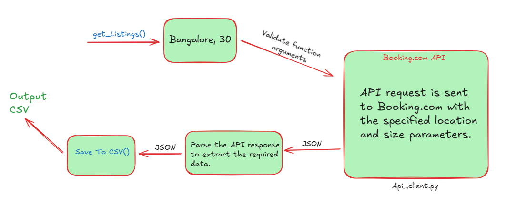

## Project Structure
- `listings.py`: Main script that handles property fetching and CSV generation
- `api_client.py`: Contains API interaction logic and request builders
- `test_listings.py`: Unit tests for the listings functionality

## Prerequisites
- Python 3.7+
- pip (Python package manager)
- [Excalidraw](https://excalidraw.com/#json=WYxcXzQbYobms4SvIIWlQ,aPDHDAAvNGAC2_TZcGJBGQ) (for visual diagrams)



## Demo & Documentation
Watch the demo video to see the project in action:
[🎥 Watch Demo on Loom](https://www.loom.com/share/f4da5485591547ff8e15992a63e45fed)

## Setup 

### 1. Set Up Virtual Environment
```bash
# Create a virtual environment
python -m venv venv 

# Activate the virtual environment
# On Windows:
venv\Scripts\activate
# On macOS/Linux:
source venv/bin/activate
```

### 2. Install Required Dependencies
```bash
pip install requests 
```

### 3. Run the Main Script
```bash
python listings.py
```
This will generate a CSV file with property listings

## Running Tests

### Using pytest (Recommended)
```bash
# Install pytest if not already installed
pip install pytest

# Run tests with verbose output
pytest -v test_listings.py
```

### Using unittest
```bash
python -m unittest test_listings.py
```

## Test Coverage
The test suite covers:
- Input validation for address
- Input validation for coordinates
- Property fetching without coordinates
- Property fetching with coordinates

## Notes
- The script requires an active internet connection
- CSV output will be generated in the same directory as the script